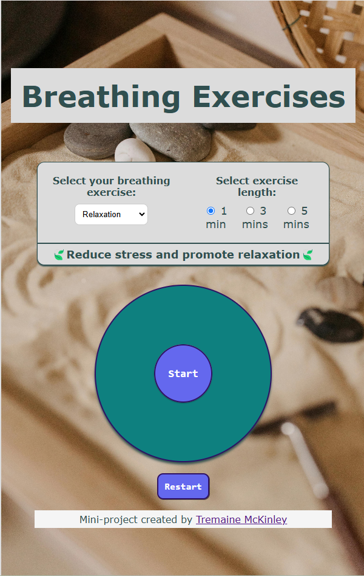

# focus-breathing-timer
Original mini-project: A mindful breathing timer for myself and others. The orignal code was written in Codecademy's workspaces with limited linters or auto-fill code as a way to test applying different transistions. 

**VERSION 2.0**: Added multiple timers and enhanced the styling

## Screenshot


## Inspiration
I've gotten so much benefit out of mindfulness training that I decided to recreate a focus breathing timer. I've seen these on apps and knew that I could create it. This was an effort to ensure my vanilla HTML/CSS/JS stays sharp.

## Timing solution
While making this, I was reminded of JavaScript's lack of a sleep() function like Python. I decided to iterate on my first idea to just make each consecutive line wait longer to simulate asynchronous activity. My simple solution was to create function that did that for me for each line of code:

```
let milliseconds = 1000;
...

function nextLine(action, seconds) {
  setTimeout(action, milliseconds);
  milliseconds += seconds*1000;
  };

```
This function took the next line of code as the first argument, and the time it should take to complete as the second. The function also added that time to the "milliseconds" variable so that each line waited long enough to start in a clean way, reducing the amount of math required for each line of code.

I was proud of finding a solution rather quickly, as if it was a self-imposed coding challenge.

## Additional Features
After reaching an initial done state, I decided to build upon this project to make a more usable product I added:
- A time option to breathe for 1, 3, or 5 minutes
- Addtional types of breathing (Relaxation, Energy, Sleep)
- Enhanced accessibilty features
- Improved visual appeal

__Thank you!__
